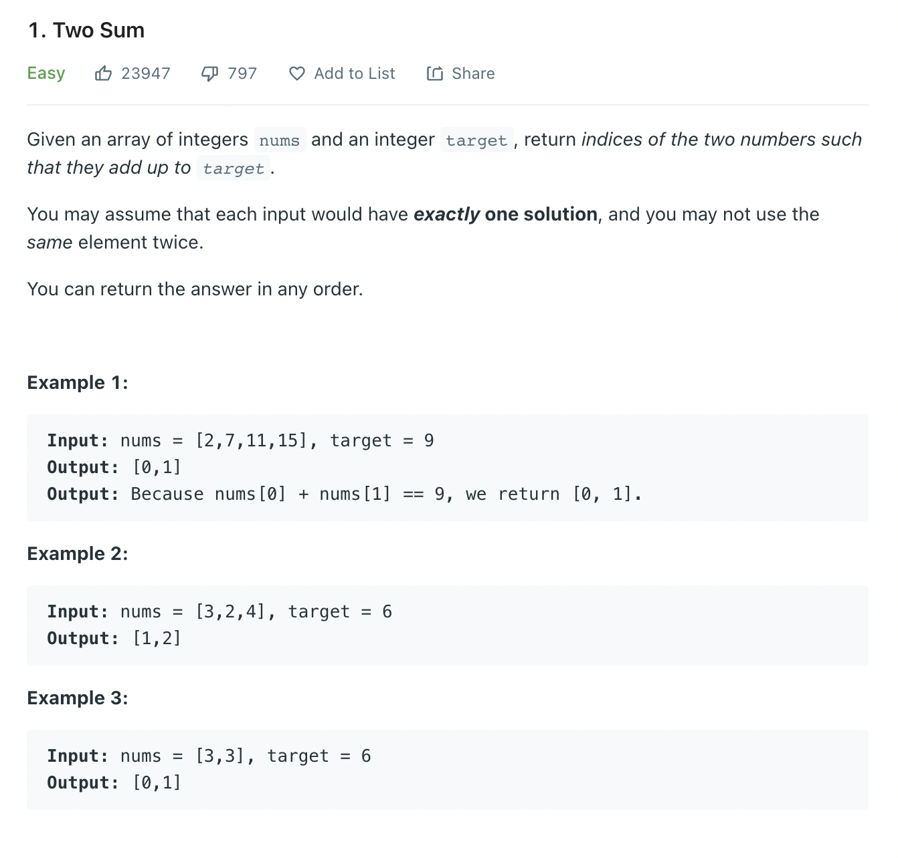

문제 [링크](https://leetcode.com/problems/two-sum)




_**Java풀이**_
```Java
class Solution {
    public int[] twoSum(int[] nums, int target) {    
        int[] answer = new int[2];
        for(int i = 0; i < nums.length; i++){
            for(int j = i+1; j < nums.length; j++){
                if(nums[i] + nums[j] == target){
                    answer[0] = i;
                    answer[1] = j;
                }
            }
        }
        return answer;
    }
}
```

_**Javascript풀이**_
```javascript
var twoSum = function(nums, target) {
    let answer = [];
    for(let i = 0; i < nums.length; i++){
        for(let j = i+1; j < nums.length; j++){
            if(nums[i] + nums[j] == target){
                answer.push(i);
                answer.push(j);
                break;
            }
        }
    }    
    return answer;
};
```
