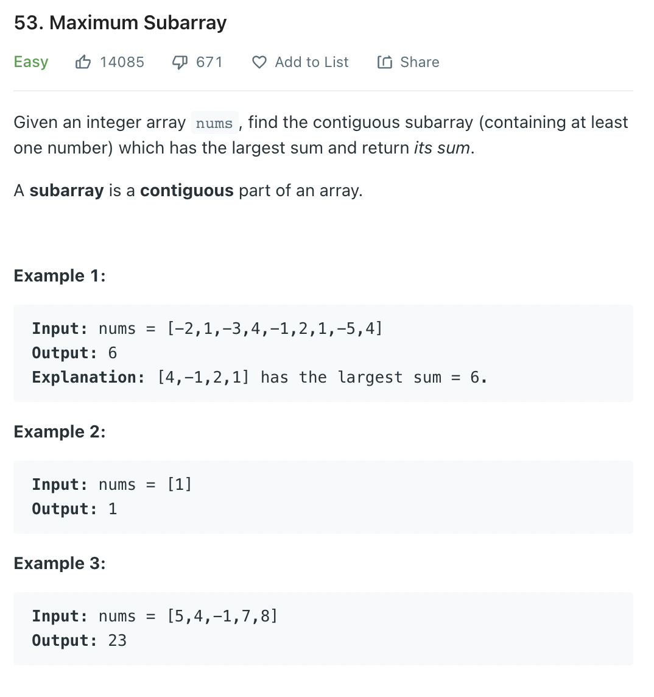

문제 [링크](https://leetcode.com/problems/maximum-subarray)




_**Java풀이**_
```java
class Solution {
    public int maxSubArray(int[] nums) {
        int max = nums[0];
        int currentValue = nums[0];
        for(int i = 1; i < nums.length; i++){
            currentValue = Math.max(currentValue + nums[i], nums[i]);
            max = Math.max(max, currentValue);
        }
        return max;
    }
}
```

_**Javascript풀이**_
```javascript
var maxSubArray = function(nums) {
    let max = nums[0];
    let currentValue = nums[0];
    for(let i = 1; i < nums.length; i++){
        currentValue = Math.max(currentValue + nums[i], nums[i]);
        max = Math.max(max, currentValue);
    }
    return max;
};
```
