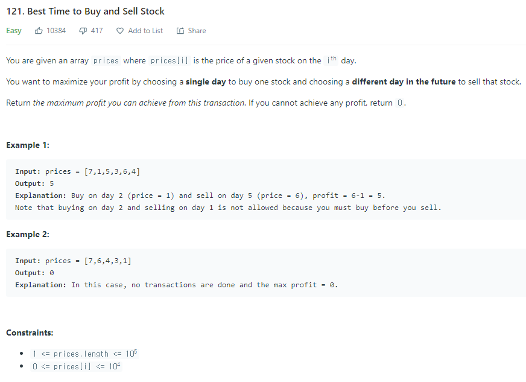

문제 [링크](https://leetcode.com/problems/best-time-to-buy-and-sell-stock/)



**_Java 풀이_**
```java
import java.util.*;

class Solution {
    
    public int maxProfit(int[] prices) {
        int answer = 0;
        int buy = Integer.MAX_VALUE;
        
        for(int i = 0; i < prices.length; i++){
            if(prices[i] < buy){
                buy = prices[i];
            }else{                
                answer = Math.max(answer, prices[i] - buy);
            }            
        }
        return answer;
    }
}
```

**_Javascript풀이_**
```javascript

var maxProfit = function(prices) {
    let buy = 10000;
    let answer = 0;
    
    for(let i = 0; i < prices.length; i++){
        if(prices[i] < buy){
            buy = prices[i];
        }else{
            answer = Math.max(answer, prices[i] - buy);
        }
    }
    return answer;
};
```
