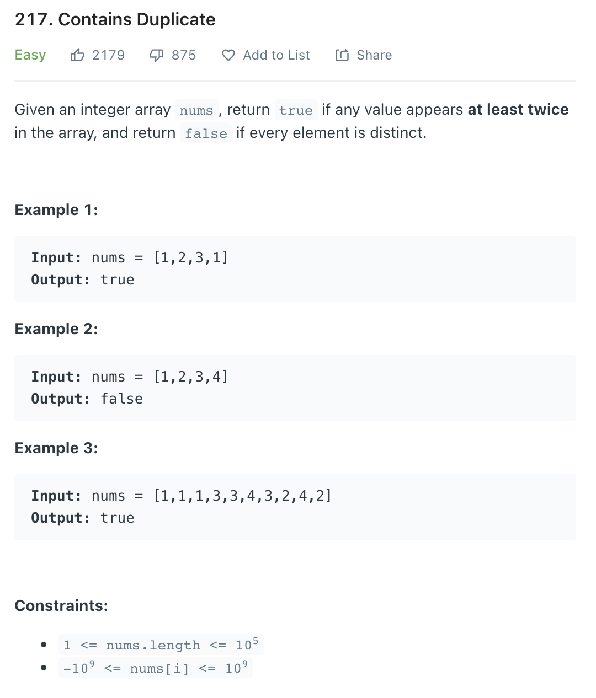

문제 [링크](https://leetcode.com/problems/contains-duplicate/)



_**Java 풀이**_
```java
import java.util.*;

class Solution {
    public boolean containsDuplicate(int[] nums) {
        Arrays.sort(nums);
        for(int i = 1; i < nums.length; i++){
            if( nums[i - 1] == nums[i] )
                return true;
        }
        return false;
    }
}
```

_**Javascript 풀이**_
```javascript
var containsDuplicate = function(nums) {
	nums.sort();
	for(let i = 1; i < nums.length; i++){
		if( nums[i - 1] == nums[i] )
			return true;
	}
	return false;
};
```
