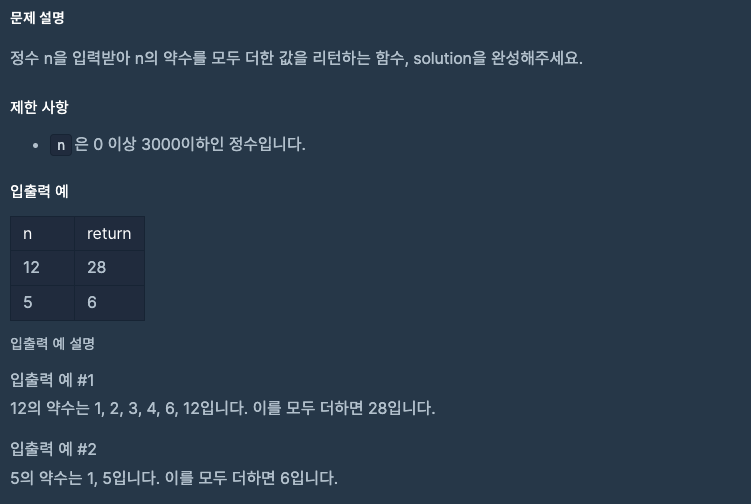

문제 [링크](https://school.programmers.co.kr/learn/courses/30/lessons/12928)



_**Java 풀이**_
```java
import java.util.*;

class Solution {
    public int solution(int n) {
        int answer = 0;
        
        ArrayList<Integer> list = new ArrayList<>();
        
        for(int i = 1; i <= n; i++){
            if( n % i == 0)
                list.add(i);
        }        
        for(int temp : list){
            answer += temp;
        }
        
        return answer;
    }
}
```
