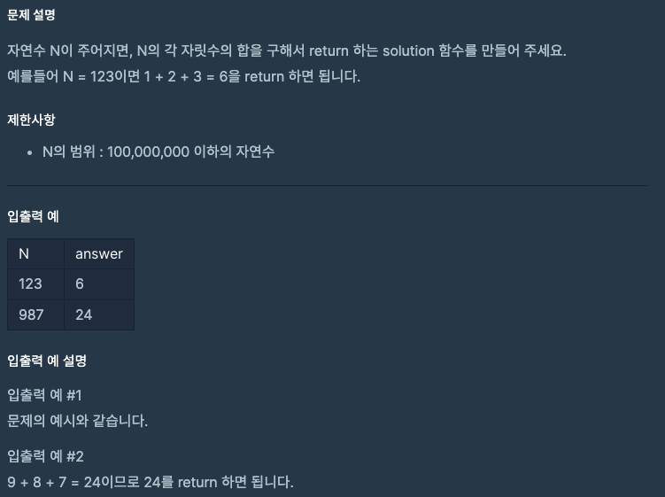

문제 [링크](https://school.programmers.co.kr/learn/courses/30/lessons/12931)



_**Java 풀이**_

#### 1번
```java
import java.util.*;

public class Solution {
    public int solution(int n) {
        int answer = 0;
        while( n > 0 ){
            answer += n % 10;
            n = n / 10;
        }
        return answer;
    }
}
```

#### 2번
```Java
import java.util.*;

public class Solution {
    public int solution(int n) {
        int answer = 0;
        String s = String.valueOf(n);    
        for(char c : s.toCharArray()){
            int num = c - '0';
            answer += num;
        }
        return answer;
    }
}
```
