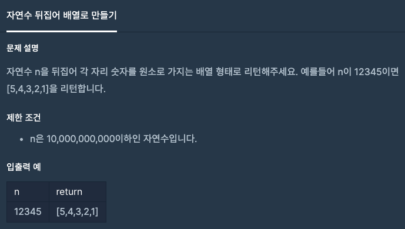

문제 [링크](https://school.programmers.co.kr/learn/courses/30/lessons/12932)



```java
import java.util.Arrays;

class Solution {
    public int[] solution(long n) {
    
        // #1
        String s = String.valueOf(n);
        s = new StringBuilder(s).reverse().toString();
        
        char[] charArr = s.toCharArray();
        int[] answer = new int[s.length()];
        
        for(int i = 0; i < answer.length; i++){
            answer[i] = charArr[i] - 48;
        }
        return answer;
        
        // #2
        List<Integer> list = new ArrayList<>();        
        while( n > 0 ){
            list.add( (int) (n % 10) );
            n = n / 10;
        }        
        return list.stream().mapToInt(Integer::intValue).toArray();
    }
}
```

```javascript
function solution(n) {
    var answer = [];    
    while( n > 0 ){
        // console.log(n);
        answer.push(n % 10);
        n = Math.floor(n / 10);
    }    
    return answer;
}
```
