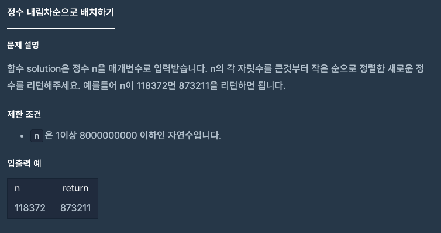

문제 [링크](https://school.programmers.co.kr/learn/courses/30/lessons/12933)



_**Java 풀이**_
```java
import java.util.*;

class Solution {
    public long solution(long n) {
        long answer = 0;
        
        String s = String.valueOf(n);
        char[] arr = s.toCharArray();
        
        Arrays.sort(arr);
        s = new StringBuilder(new String(arr)).reverse().toString();
        
        answer = Long.parseLong(s);
        
        return answer;
    }
}
```
