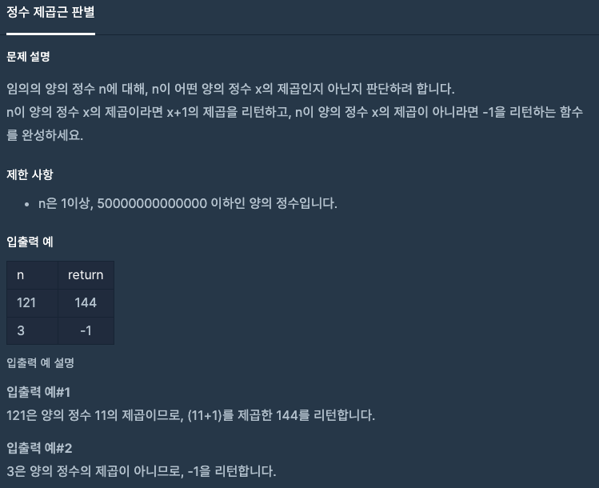

문제 [링크](https://school.programmers.co.kr/learn/courses/30/lessons/12934)



_**Java 풀이**_
```java
import java.util.*;

class Solution {
    public long solution(long n) {
        long answer = -1;
        double result = Math.sqrt(n);
        int num = (int) result;
        if( result == num )
            answer = (long) (num + 1) * (num + 1);
        return answer;
    }
}
```
