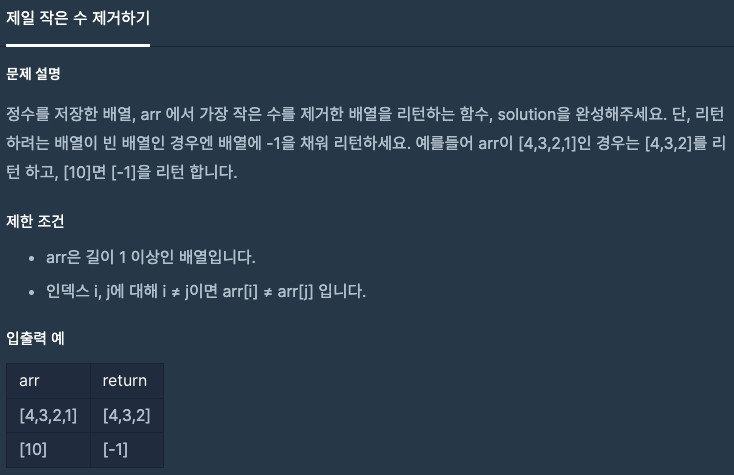

문제 [링크](https://school.programmers.co.kr/learn/courses/30/lessons/12935)



_**Java 풀이**_
```java
import java.util.*;

class Solution {
    public int[] solution(int[] arr) {
        int[] answer = {-1};
        
        if( arr.length == 1)
            return answer;
        else
            answer = new int[arr.length-1];
        
        int index = 0;
        int min = Arrays.stream(arr).min().getAsInt();
        
        for(int i = 0; i < arr.length; i++){
            if( arr[i] != min )
                answer[index++] = arr[i];
        }        
        
        return answer;
    }
}
```
