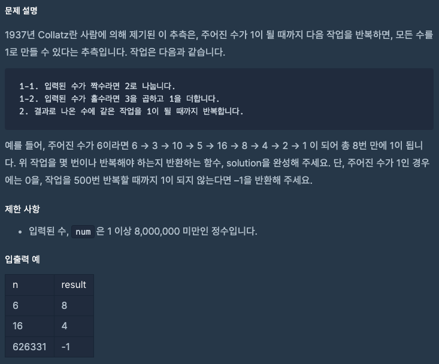
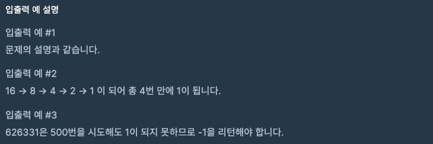

문제 [링크](https://school.programmers.co.kr/learn/courses/30/lessons/12943)




_**Java 풀이**_
```java
class Solution {
    public int solution(int num) {
        int answer = 0;
        long n = (long) num; // 숫자가 커질 경우를 대비하여 int를 long으로 바꾸어야한다.
        
        while( n > 1 ){
            if(answer >= 500){
                answer = -1;
                break;
            }            
            n = (n % 2 == 0) ? n / 2 : n * 3 + 1;
            answer++;
        }        
        return answer;
    }
}
```
