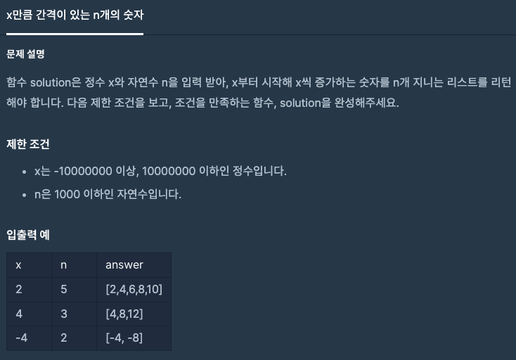

문제 [링크](https://school.programmers.co.kr/learn/courses/30/lessons/12954)



_**Java 풀이**_
```java
class Solution {
    public long[] solution(int x, int n) {
        
        long temp = 0;
        long[] answer = new long[n];
        
        for(int i = 0; i < n; i++){
            answer[i] = temp = temp + x;
        }
        
        return answer;
    }
}
```
