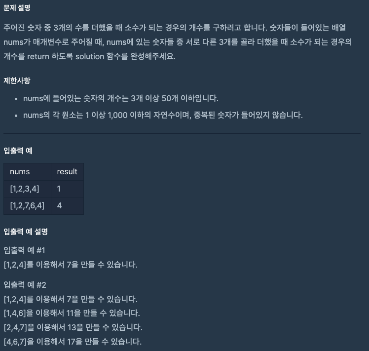

문제 [링크](https://school.programmers.co.kr/learn/courses/30/lessons/12977)



_**Java 풀이**_
```Java
class Solution {
    
    public boolean isPrime(int N){
        if( N == 1 ) return false;
        if( N == 2 ) return true;
        if( N % 2 == 0 ) return false;
        
        for(int i = 3; i <= Math.sqrt(N); i += 2){
            if( N % i == 0 )
                return false;
        }
        return true;
    }
    
    public int solution(int[] nums) {
        int answer = 0;
        
        for(int i = 0; i < nums.length; i += 1){
            for(int j = 0; j < i; j += 1){
                for(int k = 0; k < j; k += 1){
                    // System.out.println( nums[i] + nums[j] + nums[k] );
                    if( isPrime(nums[i] + nums[j] + nums[k]) ){                        
                        answer += 1;
                    }
                }
            }
        }

        return answer;
    }
}
```
