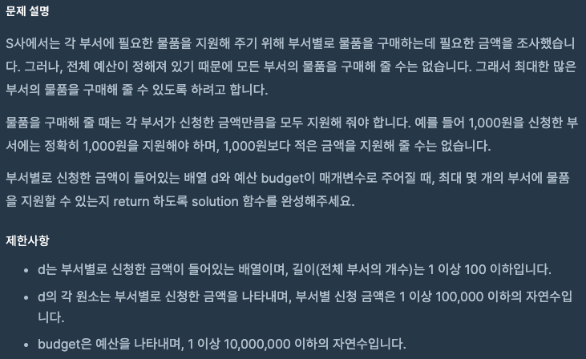
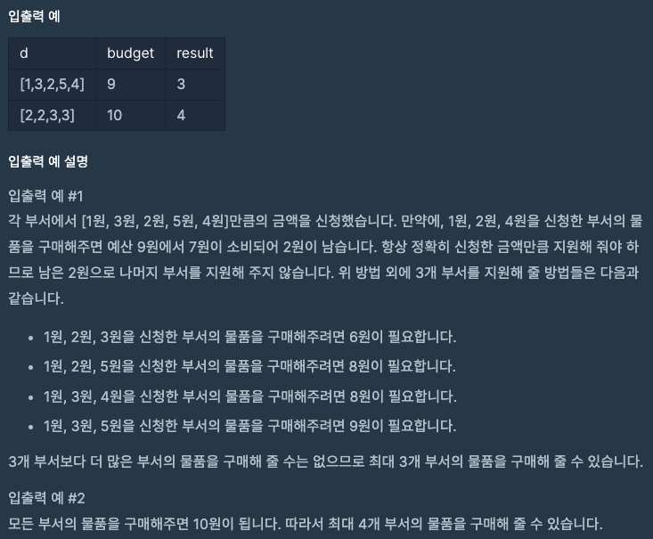

문제 [링크](https://school.programmers.co.kr/learn/courses/30/lessons/12982)




_**Java 풀이**_
```java
import java.util.*;

class Solution {
    public int solution(int[] d, int budget) {
        int answer = 0;
        Arrays.sort(d);
        for(int i = 0; i < d.length; i++){
            if( budget == 0 || budget < d[i]){
                break;
            }
            budget -= d[i];
            answer = i+1;
        }
        
        return answer;
    }
}
```
