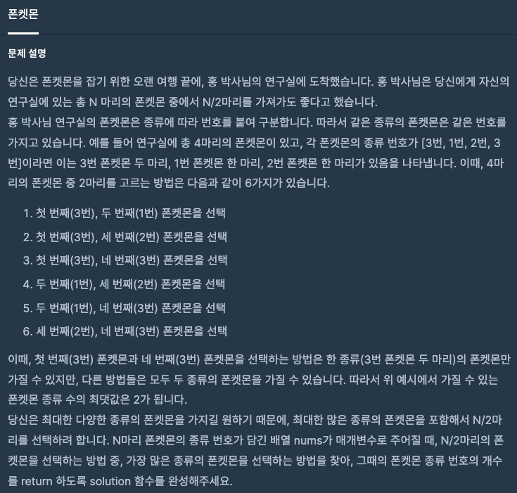

문제 [링크](https://school.programmers.co.kr/learn/courses/30/lessons/1845)




_**Java 풀이**_
```java
import java.util.*;

class Solution {
    public int solution(int[] nums) {
        int answer = 0;
        Map<Integer, Integer> map = new HashMap<Integer, Integer>();
        
        for(int i = 0; i < nums.length; i++){
            int count = map.getOrDefault(nums[i], 0);
            
            if( count == 0 ){
                map.put(nums[i], 1);
            }
        }
        
        if( map.size() > nums.length/2 ){
            answer = nums.length/2;
        }else{
            answer = map.size();
        }
        
        return answer;
    }
}
```
