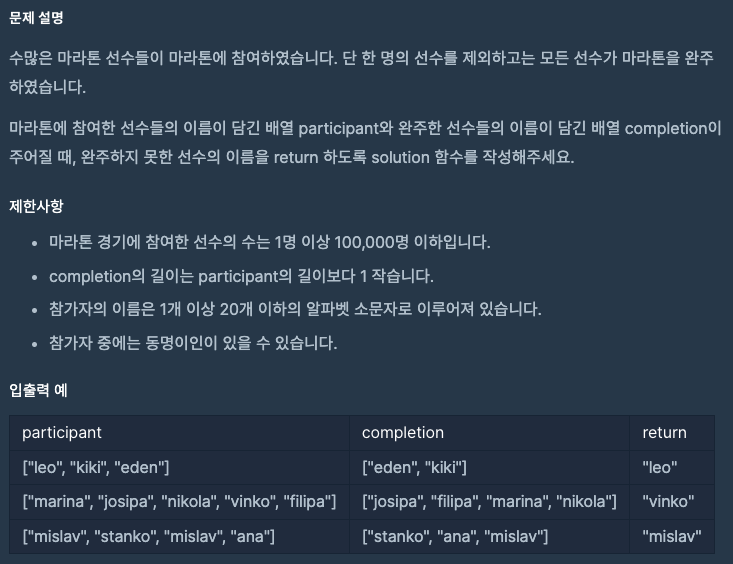
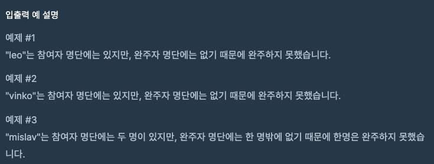

문제 [링크](https://school.programmers.co.kr/learn/courses/30/lessons/42576)




_**Java 풀이**_
```java
import java.util.Arrays;

class Solution {    
    public String solution(String[] participant, String[] completion) {
        
        Arrays.sort(participant);
        Arrays.sort(completion);
                
        int index = 0;
        int length = completion.length;
        
        for(; index < length; index++){
            if( !completion[index].equals(participant[index]) ){
                return participant[index];
            }
        }
        return participant[index];
        
    }
}
```

_**Javascript 풀이**_
```javascript
function solution(participant, completion) {
    
    Array.prototype.sort.call(participant);
    Array.prototype.sort.call(completion);
    var index = 0;
    var length = completion.length;
    for(; index < length; index++){
        if( completion[index] !== participant[index] ){
            return participant[index];
        }
    }
    return participant[index];
}
```
