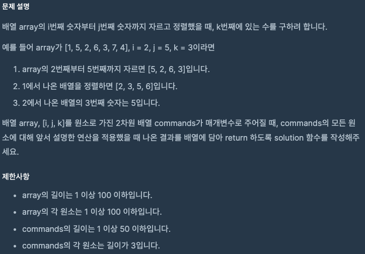
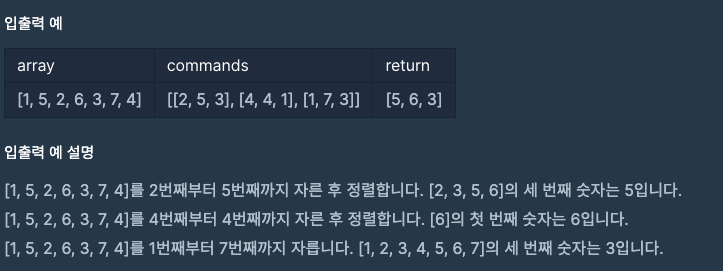

문제 [링크](https://school.programmers.co.kr/learn/courses/30/lessons/42748)




_**Java 풀이**_
```java
import java.util.Arrays;

class Solution {
    public int[] solution(int[] array, int[][] commands) {
        int[] answer = new int[commands.length];
        
        for(int index = 0; index < commands.length; index = index + 1){
            int[] command = commands[index];
            int i = command[0];
            int j = command[1];
            int k = command[2];
            
            int[] arr = Arrays.copyOfRange(array, i-1, j);
            Arrays.sort(arr);
            answer[index] = arr[k-1];
        }
        return answer;
    }
}
```

_**Javascript 풀이**_
```javascript
function solution(array, commands) {
    var answer = [];    
    var arr, command, index, i, j ,k;
    for(index = 0; index < commands.length; index = index + 1){
        command = commands[index];
        i = command[0];
        j = command[1];
        k = command[2];
        
        arr = array.slice(i-1, j);        
        arr.sort(function(a, b){
            return a - b;
        });
        answer.push(arr[k-1]);
    }
    return answer;
}
```
