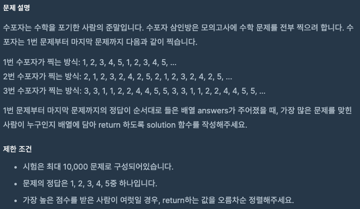
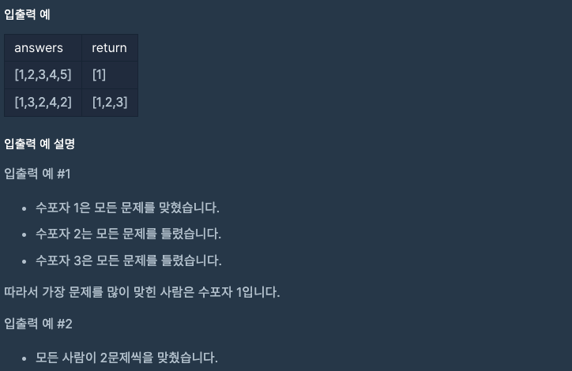

문제 [링크](https://school.programmers.co.kr/learn/courses/30/lessons/42840)





_**Java 풀이**_
```java
import java.util.List;
import java.util.Arrays;
import java.util.ArrayList;
import java.util.Collections;


class Solution {
    public int[] solution(int[] answers) {
        int[] answer = {};
        
        int[] A = {1, 2, 3, 4, 5};
        int[] B = {2, 1, 2, 3, 2, 4, 2, 5};
        int[] C = {3, 3, 1, 1, 2, 2, 4, 4, 5, 5};
        
        int A_OK = 0;
        int B_OK = 0;
        int C_OK = 0;
        
        for(int index = 0; index < answers.length; index = index + 1){
            if( answers[index] == A[index % 5] ){
                A_OK++;
            }
            if( answers[index] == B[index % 8] ){
                B_OK++;
            }
            if( answers[index] == C[index % 10] ){
                C_OK++;
            }
        }
        
        int[] result = { A_OK, B_OK, C_OK };
        int max = Arrays.stream(result).max().getAsInt();        
        List<Integer> list = new ArrayList<Integer>();        
        for(int index = 0; index < result.length; index = index + 1){
            if( max == result[index] ){
                list.add(index + 1);
            }
        }        
        // System.out.println( Arrays.toString( list.toArray() ) );
        answer = new int[list.size()];        
        for(int index = 0; index < answer.length; index = index + 1){
            answer[index] = list.get(index);
        }        
        return answer;
    }
}
```

_**Javascript 풀이**_
```javascript
function solution(answers) {
    var answer = [];
    
    var A = [1, 2, 3, 4, 5];
    var B = [2, 1, 2, 3, 2, 4, 2, 5];
    var C = [3, 3, 1, 1, 2, 2, 4, 4, 5, 5];
    
    // var A_index = 0;
    // var B_index = 0;
    // var C_index = 0;
        
    var A_OK = 0;
    var B_OK = 0;
    var C_OK = 0;
    
    for(var index = 0; index < answers.length; index++){
        // A_index = (index > A.length - 1) ? index - A.length - 1 : index;
        // B_index = (index > B.length - 1) ? index - B.length - 1 : index;
        // C_index = (index > C.length - 1) ? index - C.length - 1 : index;        
        // if( answers[index] === A[A_index] ){
        //     A_OK++;
        // }
        // if( answers[index] === B[B_index] ){
        //     B_OK++;
        // }
        // if( answers[index] === C[C_index] ){
        //     C_OK++;
        // }
        if( answers[index] === A[index % 5] ){
            A_OK++;
        }
        if( answers[index] === B[index % 8] ){
            B_OK++;
        }
        if( answers[index] === C[index % 10] ){
            C_OK++;
        }
    }
    var result = [A_OK, B_OK, C_OK];
    var max = Math.max.apply(null, result);
    for(index = 0; index < result.length; index = index + 1){
        if( max === result[index]){
            answer.push(index+1);
        }
    }
    return answer;
}
```
