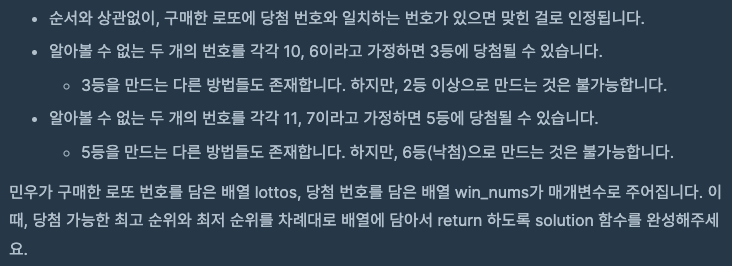

문제 [링크](https://school.programmers.co.kr/learn/courses/30/lessons/77484)





_**Java 풀이**_
```java
import java.util.*;

class Solution {
    public int[] solution(int[] lottos, int[] win_nums) {
        int[] answer = new int[2];
        int[] rank = {6,6,5,4,3,2,1};
        
        int min = 0;
        int max = 0;
        for(int i = 0; i < lottos.length; i++){
            for(int j = 0; j < win_nums.length; j++){
                if( lottos[i] == win_nums[j] ) min++;
            }
            
            if( lottos[i] == 0 ) max++;
        }
        
        answer[0] = rank[min+max];
        answer[1] = rank[min];
        
        return answer;
    }
}
```
