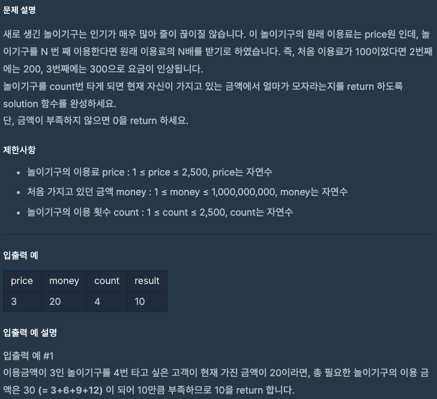

문제 [링크](https://school.programmers.co.kr/learn/courses/30/lessons/82612)



_**Java 풀이**_
```java
class Solution {
    public long solution(int price, int money, int count) {
        long money2 = Long.valueOf(money);
        for(int index = 1; index <= count; index++){
            money2 -= price * index;
        }
        return money2 < 0 ? money2 * -1 : 0;
    }
}
```
_**Java 풀이**_
```java
function solution(price, money, count) {
    for(var index = 1; index <= count; index = index +1){
        money -= price * index;
    }
    return money < 0 ? money * -1 : 0;
}
```
