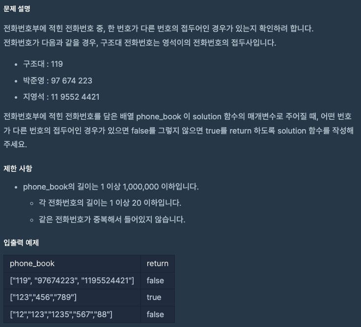
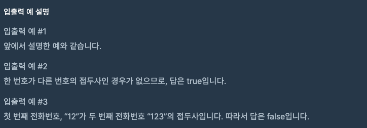

문제 [링크](hhttps://school.programmers.co.kr/learn/courses/30/lessons/42577)




_**Java 풀이**_
```java
import java.util.Arrays;
import java.util.HashMap;
import java.util.Map;

class Solution {
    public boolean solution(String[] phone_book) {
        Arrays.sort(phone_book);        
        int length = phone_book.length;
        
        Map<String, String> map = new HashMap<String, String>();
        
        for(String temp : phone_book){
            map.put(temp, temp);
        }
        
        for(String str : phone_book){
            for(int index = 0; index < str.length(); index++){
                String temp = str.substring(0, index);                
                if( map.containsKey( temp ) ){
                    return false;
                }
            }
        }
        
        // for(int index = 0; index < length; index++){            
        //     for(int index2 = 0; index2 < length; index2++){
        //         if( index != index2 && phone_book[index2].indexOf( phone_book[index] ) == 0){
        //             return false;
        //         }
        //     }
        // }
        
        return true;
    }
}
```
