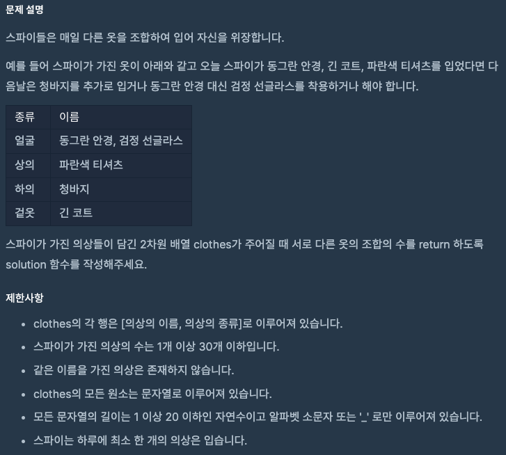
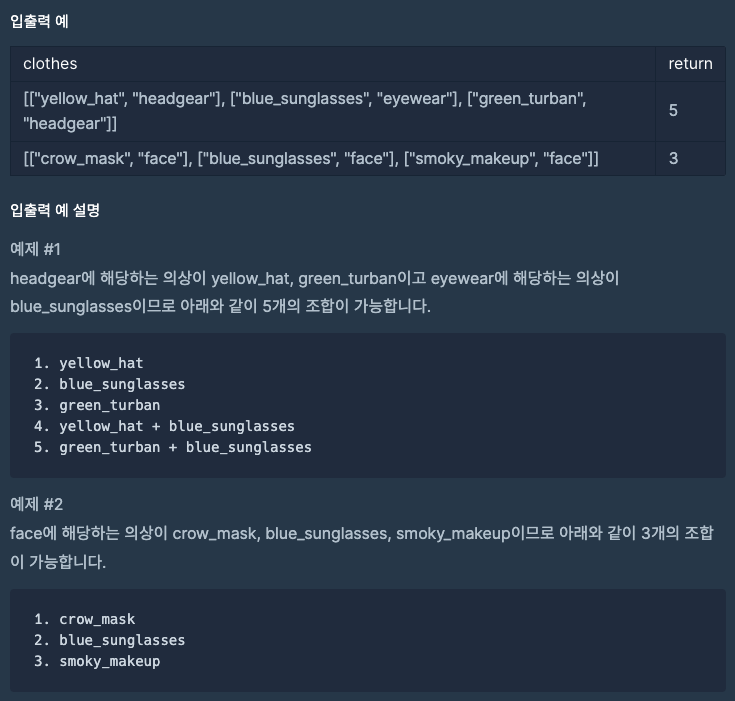

문제 [링크](https://school.programmers.co.kr/learn/courses/30/lessons/42578)




_**Java 풀이**_
```java
import java.util.HashMap;
import java.util.Map;

class Solution {
    public int solution(String[][] clothes) {
        int answer = 1; 
        Map<String, Integer> map = new HashMap<String, Integer>();
        
        for(String[] cloth : clothes){            
            String div = cloth[1];
            String name = cloth[0];
            
            if( map.get(div) != null ){
                map.put(div, map.get(div) + 1);
            }else{
                map.put(div, 1);
            }            
        }
                
        for( String key : map.keySet() ){
            int value = map.get(key);
            answer *= (value + 1);
        }
        
        return answer -1 ;
    }
}
```

_**javascript 풀이**_
```javascript
function solution(clothes) {
    var result = 1;
    var a = {};
    for(var index = 0; index < clothes.length; index++){
        var name = clothes[index][0];
        var div = clothes[index][1];        
        
        if( a[div] === null || a[div] === undefined )
            a[div] = 1;
        else
            a[div] += 1;
    }
    for(var key in a){
        result = result * (a[key]+1);
    }
    // console.log(result);
    return result - 1;
}
```
