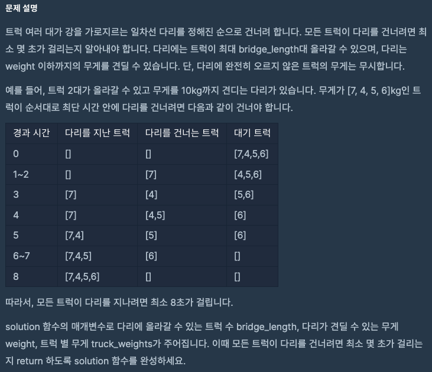
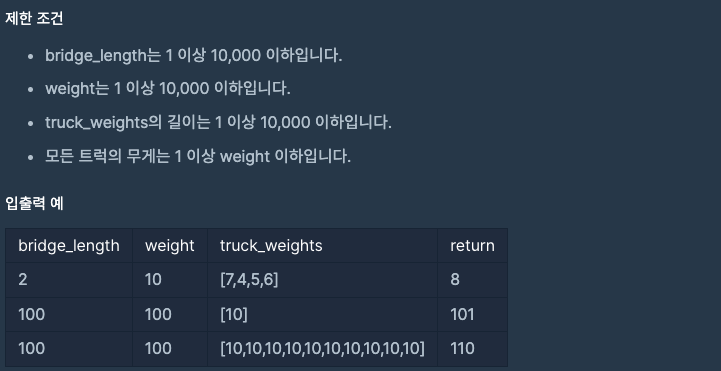

문제 [링크](https://school.programmers.co.kr/learn/courses/30/lessons/42583)




_**Java 풀이**_
```java
import java.util.List;
import java.util.ArrayList;
import java.util.Arrays;
import java.util.stream.Collectors;

class Solution {
    
    private int getSumWeight(List<Integer> bridge){
        int result = 0;
        for(Integer temp : bridge){
            result += temp;
        }
        // System.out.println(result);
        return result;
    }
    
    private static int[] arrayShift(int[] param, int deleteIndex){
        List<Integer> paramList = Arrays.stream(param).boxed().collect(Collectors.toList());
        paramList.remove(deleteIndex);

        int[] result = new int[paramList.size()];
        int index = 0;
        for(int temp : paramList){
            result[index] = temp;
            index++;
        }
        return result;
    }
    
    public int solution(int bridge_length, int weight, int[] truck_weights) {
        int answer = 0;
                
        List<Integer> bridge = new ArrayList<Integer>();
        for(int index = 0; index < bridge_length; index++){
            bridge.add(0);
        }
        
        while( bridge.size() > 0 ){
            bridge.remove(0);
            answer++;
            
            if( truck_weights.length > 0 ){
                int sum = getSumWeight(bridge);
                if( sum + truck_weights[0] <= weight ){
                    bridge.add(truck_weights[0]);
                    truck_weights = arrayShift(truck_weights, 0);
                }else{
                    bridge.add(0);
                }
            }
        }
        
        return answer;
    }
}
```

_**Java 풀이**_
```javascript
// 배열 요소 값의 총합을 구한다.
function getSumWeight(arr){
    var result = 0;
    if( arr.length ){
        for(var index = 0; index < arr.length; index++){
            result += arr[index];
        }
    }
    return result;
}

function solution(bridge_length, weight, truck_weights) {
    var answer = 0;    
    var bridge = new Array();
    var index;
    
    // 다리 배열을 만들자
    for(index = 0; index < bridge_length; index++){
        bridge[index] = 0;
    }    
    // 다리 배열이 존재할 때 까지
    while( bridge.length > 0 ){             
        // 한 턴에 한칸씩 앞으로 가므로, 다리 배열 맨 앞에 있는 한칸(트럭)을 뺀다.
        // 대기 중인 트럭이 있다면 나중에 한칸 추가할 것이고,
        // 대기 트럭이 없어지면 다리에서 계속 빠지기만 하므로 결국은 루프가 끝난다.
        bridge.shift();
        
        // 경과 시간을 증가시킨다.
        answer = answer + 1;
        
        // 대기 트럭이 존재할 때만 다리(배열)에 트럭(요소)을 추가한다.
        if( truck_weights.length > 0 ){
                       
            // 현재 다리(배열)에 올라가 있는 트럭의 무게 총합을 구한다.
            var sum = getSumWeight(bridge);
            
            // 현재 다리 위에 트럭의 무게 총합 + 대기 중인 트럭의 첫번째 차의 무게가 견딜 수 있는 무게인지 비교한다.
            if( sum + truck_weights[0] <= weight ){
                // 견딜 수 있다면 대기 트럭(배열)에서 뺀 후 다리(배열)에 추가한다.
                bridge.push(truck_weights.shift());
            }else{
                // 견딜 수 없다면 추가하지 않는다. (0으로 추가한다)
                bridge.push(0);
            }
        }
    }
    return answer;
}
```
