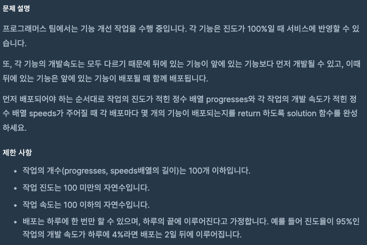
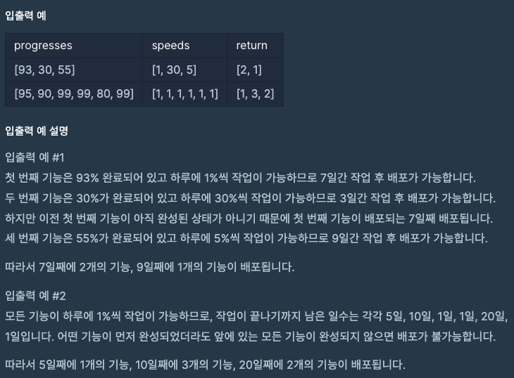

문제 [링크](https://school.programmers.co.kr/learn/courses/30/lessons/42586)




_**Java 풀이**_
```java
import java.util.List;
import java.util.ArrayList;
import java.util.Arrays;
import java.util.stream.Collectors;

class Solution {
    
    private static int[] arrayShift(int[] param, int deleteIndex){
        List<Integer> paramList = Arrays.stream(param).boxed().collect(Collectors.toList());
        paramList.remove(deleteIndex);

        int[] result = new int[paramList.size()];
        int index = 0;
        for(int temp : paramList){
            result[index] = temp;
            index++;
        }
        return result;
    }
    
    public int[] solution(int[] progresses, int[] speeds) {
        
        int[] answer = {};
        List<Integer> answerList = new ArrayList<Integer>();
        
        // 진척율이 하나라도 있을 때 까지 루프
        while(progresses.length > 0){
            int releaseCount = 0;

            // 하루씩 진도 체크
            for(int index = 0; index < progresses.length; index++){
                // 진척율이 100보다 낮으면 스피드에 따라 진척율을 올린다.
                if( progresses[index] < 100 ){
                    progresses[index] += speeds[index];
                }
            }

            // 앞의 기능이 완료 됐는지를 확인해가면서 카운팅
            while(progresses.length > 0 && progresses[0] >= 100){
                releaseCount = releaseCount + 1;
                
                // 카운팅이 끝난건 리스트에서 빼주자
                // Java는 배열을 인덱스로 삭제할 수 없어 함수를 따로 만들었다.
                progresses = arrayShift(progresses, 0);
                speeds = arrayShift(speeds, 0);
            }

            // 배포할 건수가 하나라도 있으면 결과 값에 추가한다.
            if( releaseCount > 0 ){
                // 결과 값의 전체 길이를 미리 알 수 없으므로
                // List형식으로 add한 뒤에 나중에 배열로 전환한다.
                answerList.add(releaseCount);
            }
        }
        
        if(answerList.size() > 0 ){
            // 결과의 사이즈를 계산하여 배열의 크기를 재정의한다.
            answer = new int[answerList.size()];

            // List 결과 요소 값을 배열에 담아준다.
            for(int index = 0; index < answerList.size(); index++){
                answer[index] = answerList.get(index);
            }
        }
        
        return answer;
    }
}
```

_**Javascript 풀이**_
```javascript
function solution(progresses, speeds) {
    var answer = [];
    var index = 0;
    var releaseCount;
    
    while(progresses.length > 0){
        releaseCount = 0;
        // 하루에 한바퀴씩 돌면서 진도 체크
        for(index = 0; index < progresses.length; index = index + 1){
            if( progresses[index] < 100 ){
                progresses[index] += speeds[index];
            }
        }
        // 앞의 기능이 완료 됐는지를 확인해가면서 카운팅
        while(progresses[0] >= 100){
            releaseCount = releaseCount + 1;
            
            // 카운팅이 끝난건 리스트에서 빼주자
            progresses.shift();
            speeds.shift();
        }
        
        if ( releaseCount > 0 ) {
            answer.push(releaseCount);
        }
    }
    return answer;
}
```
