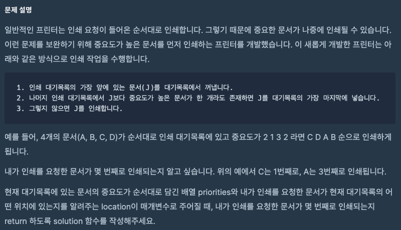
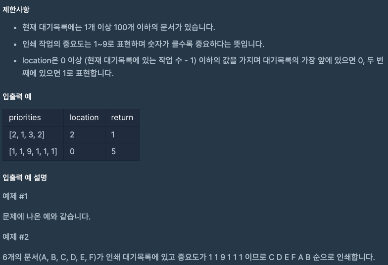

문제 [링크](https://school.programmers.co.kr/learn/courses/30/lessons/42587)




_**Java 풀이**_
```Java
import java.util.ArrayList;
import java.util.List;
import java.util.Arrays;
import java.util.Map;
import java.util.HashMap;

class Solution {
    
    public boolean compare(List<Map<String, Integer>> list, int param){
        boolean result = false;
        for(int index = 0; index < list.size(); index = index + 1){
            Map<String, Integer> map = list.get(index);
            int priority = (Integer) map.get("priority");

            if( priority > param ){
                result = true;
                break;
            }
        }
        return result;
    }
    
    public int solution(int[] priorities, int location) {
        int answer = 1;
        
        List<Map<String, Integer>> aTemp = new ArrayList<Map<String, Integer>>();
        for(int index = 0; index < priorities.length; index = index + 1){
            Map<String, Integer> temp = new HashMap<String, Integer>();
            temp.put("location", index);
            temp.put("priority", priorities[index]);
            aTemp.add( temp );
        }

        while( true ){
            Map<String, Integer> oTemp = aTemp.get(0);
            aTemp.remove(0);

            if( compare( aTemp, oTemp.get("priority")) == true ){
                aTemp.add(oTemp);
            }else{
                if(oTemp.get("location") != location){
                    answer = answer + 1;
                }else{
                    break;
                }
            }
        }
        return answer;
    }
}
```

_**Javascript 풀이**_
```javascript
// 배열 내에 특정 값 보다 큰 값이 있는지 체크
function compare(arr, param){
    var result = false;
    for(var index = 0; index < arr.length; index++){
        if( arr[index].priority > param ){
            result = true;
        }
    }
    return result;
}

function solution(priorities, location) {
    var answer = 1;
    
    var index = 0;
    var temp = new Array();    
    
    for(; index < priorities.length; index++){
        temp[index] = { location : index, priority : priorities[index] };
    }
    
    while( true ){
        var oTemp = temp[0];
        temp.shift();
        
        if( compare(temp, oTemp.priority) == true ){
            temp.push(oTemp);
        } else {
            if(oTemp.location !== location){
                answer = answer + 1;
            } else {
                break;
            }
        }        
    }    
    return answer;
}
```
