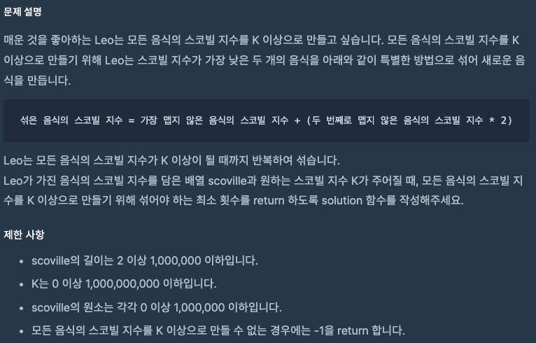
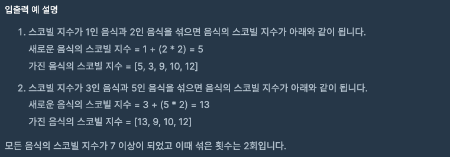

문제 [링크](https://school.programmers.co.kr/learn/courses/30/lessons/42626)




_**Java 풀이**_
```java
import java.util.PriorityQueue;

class Solution {
    public int solution(int[] scoville, int K) {
        int answer = 0;
        
        PriorityQueue<Integer> heap = new PriorityQueue();
        
        // 우선순위 큐에 scoville 요소 값을 복사
        for(int index = 0; index < scoville.length; index = index + 1){
            /*
             * 추가 시, add 혹은 offer를 사용
             * add는 추가에 성공하면 true를 반환하고 실패 시 IllegalStateException을 발생시킨다.
             */
            // heap.add(scoville[index]);
            heap.offer(scoville[index]);
        }
        
        // peek: Priority Queue에서 우선순위가 가장 높은 값을 참조
        while(heap.peek() <= K){
            // 모든 음식의 스코빌 지수를 K 이상으로 만들 수 없는 경우 -1을 return
            if(heap.size() == 1){
                return -1;
            }            
            // poll: Priority Queue에서 첫번째 값을 반환하고 제거 비어있다면 null
            int first = heap.poll();                // 가장 맵지 않은 음식의 스코빌 지수
            int second = heap.poll();               // 두 번째로 맵지 않은 음식의 스코빌 지수
            int shaked = first + (second * 2);      // 섞은 음식의 스코빌 지수
            
            heap.offer(shaked);
            answer = answer + 1;
        }        
        return answer;
    }
}
```
