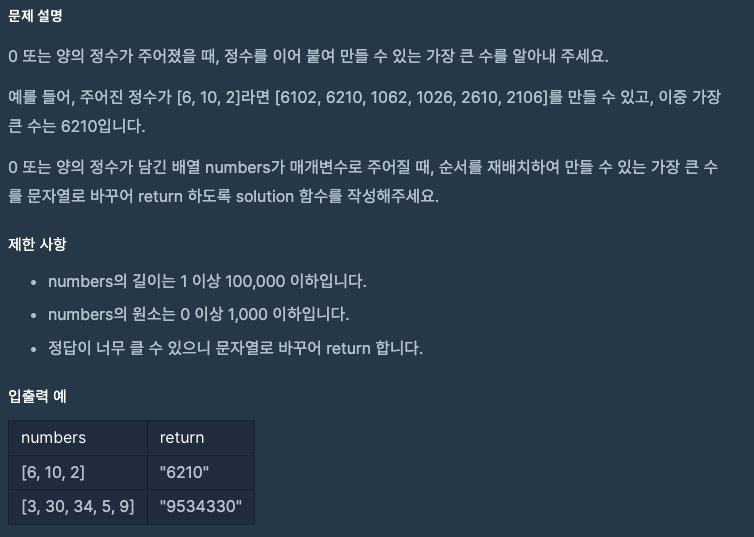

문제 [링크](https://school.programmers.co.kr/learn/courses/30/lessons/42746)



_**Java 풀이**_
```java
import java.util.Arrays;
import java.util.Comparator;

class Solution {
    public String solution(int[] numbers) {
        String answer = "";
        String[] strings = new String[numbers.length];
        
        for(int index = 0; index < numbers.length; index = index + 1){
            strings[index] = String.valueOf( numbers[index] );
        }
        
        Arrays.sort(strings, new Comparator<String>(){
            @Override
            public int compare(String a, String b) {
                // return a - b;
                return (b + a).compareTo(a + b);
            }
        });
        
        answer = strings[0].equals("0") ? "0" : String.join("", strings);
        
        return answer;
    }
}
```

_**Javascript 풀이**_
```javascript
function solution(numbers) {
    var answer = '';
    var index;
    
    for(index = 0; index < numbers.length; index = index + 1){
        numbers[index] = numbers[index].toString();
    }
    numbers.sort(function(a, b){
        return ( b + a ) - ( a + b );
    });
    answer = numbers[0] === '0' ? '0' : numbers.join('');
    return answer;
}
```
