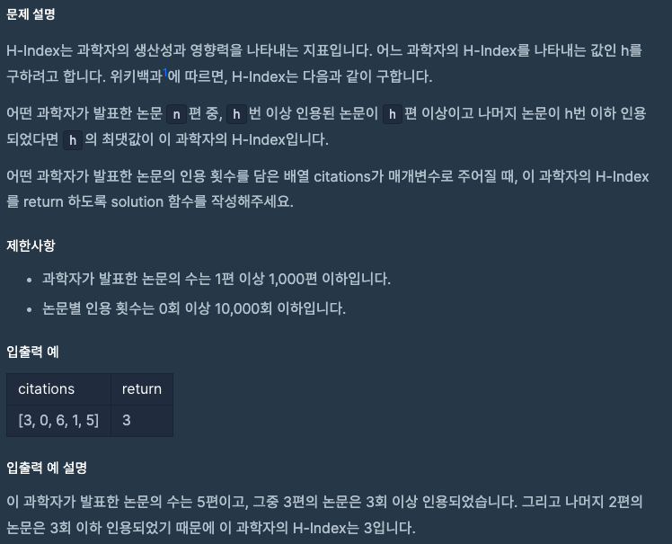

문제 [링크](https://school.programmers.co.kr/learn/courses/30/lessons/42747)



_**Java 풀이**_
```java
import java.util.Arrays;

class Solution {
    public int solution(int[] citations) {
        int answer = 0;
        
        Arrays.sort(citations);
        
        int n = citations.length;
        int h = 0;
        int k = 0;
        
        for(int index = 0; index < n; index = index + 1){
            h = citations[index];
            k = n - index;
            
            if( k <= h ){
                answer = k;
                break;
            }
        }        
        return answer;
    }
}
```
_**Javascript 풀이**_
```javascript
function solution(citations) {
    var answer = 0;
    
    Array.prototype.sort.call(citations, function(a, b){
        return a - b;
    });
    
    var n = citations.length;
    var h = 0;
    var k = 0;
    for(var index = 0; index < n; index = index + 1){
        h = citations[index];
        k = n - index;
        if( k <= h ){
            answer = k;
            break;
        }
    }
    return answer;
}
```
