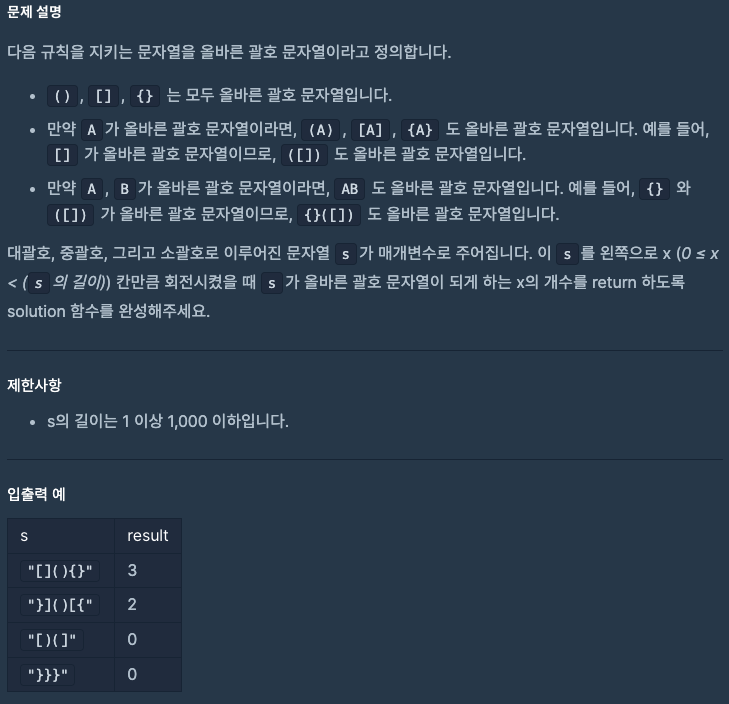
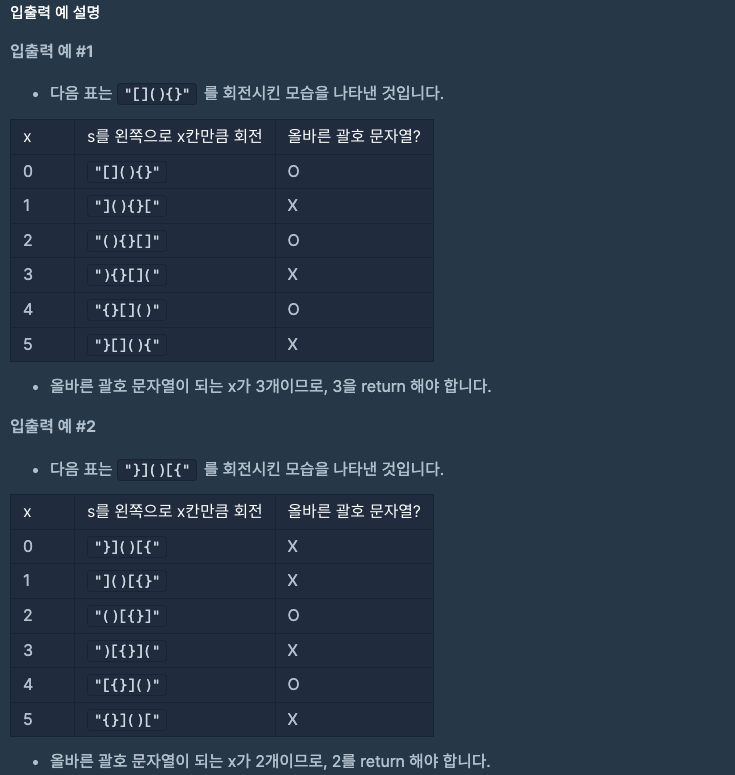
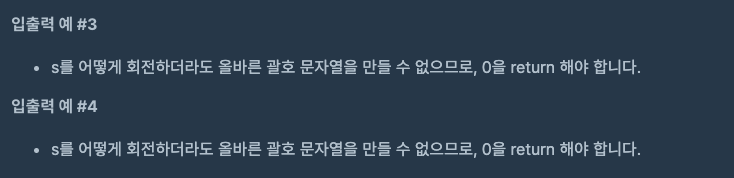

문제 [링크](https://school.programmers.co.kr/learn/courses/30/lessons/76502)





_**Java 풀이**_
```java
import java.util.*;

class Solution {
    public int solution(String s) {
        int answer = 0;

        for( int index = 0; index < s.length(); index++){
            String a = s.substring(0, 1);
            String b = s.substring(1, s.length());
            s = b + a;            

            Stack<String> stack = new Stack<>();
            for( int k = 0; k < s.length(); k++){
                String key = s.substring(k, k + 1);

                if(stack.isEmpty()){
                    stack.push(key);
                    continue;
                }

                switch ( key ) {
                    case "[" :
                        stack.push("[");
                        break;
                    case "]" :
                        if( stack.peek().equals("[") ) stack.pop();
                        break;
                    case "{" :
                        stack.push("{");
                        break;
                    case "}" :
                        if( stack.peek().equals("{") ) stack.pop();
                        break;
                    case "(" : 
                        stack.push("(");
                        break;
                    case ")" :
                        if( stack.peek().equals("(") ) stack.pop();
                        break;
                }
            }

            if(stack.isEmpty() == true){
                answer++;
            }
        }

        return answer;
    }
}
```
