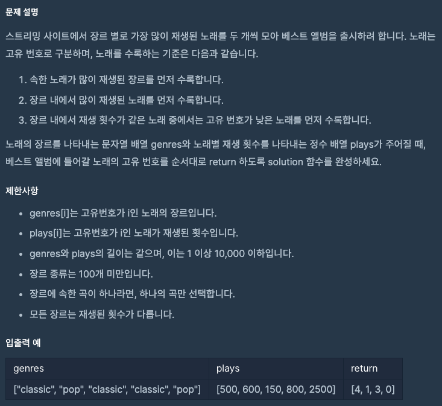
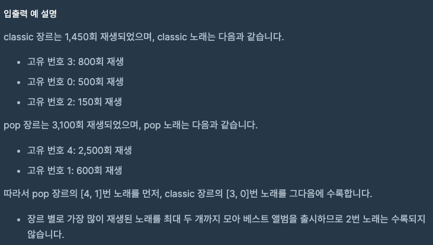

문제 [링크](https://school.programmers.co.kr/learn/courses/30/lessons/42579)




_**Java 풀이**_
Step By Step으로 나눠서 풀어야한다.
1. 장르별 전체 플레이 수를 저장한 객체를 구함
```javascript
{ classic: 1450, pop: 3100 }
```

2. 장르별로 장르와 플레이수, 인덱스를 요소로 가지는 객체의 배열을 구함
```javascript
{
		classic: [
            { genre: 'classic', play: 500, index: 0 },
			{ genre: 'classic', play: 150, index: 2 },
			{ genre: 'classic', play: 800, index: 3 }
		], 
		pop: [
            { genre: 'pop', play: 600, index: 1 },
			{ genre: 'pop', play: 2500, index: 4 }
		]
}
```

3. 1번에서 정의한 객체를 장르와 플레이수를 요소로 가지는 객체의 배열로 변경한다.
```javascript
[ { genre: 'classic', play: 1450 }, { genre: 'pop', play: 3100 } ]
```

4. 3번에서 정의한 장르별 전체 카운트 배열을 내림차순 정렬한다.
```javascript
[ { genre: 'pop', play: 3100 }, { genre: 'classic', play: 1450 } ]
```

5. 4번에서 완성한 배열을 기준으로 루프 -> 장르를 기준으로 2번에서 배열을 가져온 후, 가져온 배열을 오름차순 정렬한 뒤에 앞에 2개만 PUSH한다.


```javascript
function solution(genres, plays) {
    var answer = [];
    
    var songs = {};
    var total = {};
    var totalArr = [];
    
    // 장르별 total play 객체 생성 + 장르별로 장르와 플레이수, 인덱스를 요소로 가지는 객체의 배열
    for(var index = 0; index < genres.length; index++){
        var genre = genres[index];
        var play = plays[index];
        
        if ( total[genre] === null || total[genre] === undefined ) {
            total[genre] = play;
        } else {
            total[genre] += play;
        }
        
        if( songs[genre] === null || songs[genre] === undefined ){
            songs[genre] = [];
        }
        songs[genre].push({
            genre : genre,
            play : play,
            index : index
        });
    }
    
    // 정렬을 위해 배열로 변경
    for(var key in total){
        totalArr.push({
            genre : key,
            play : total[key]
        });
    }
    
    // 전체 카운트 내림차순 정렬
    totalArr.sort(function(a, b){
        var aValue = a.play;
        var bValue = b.play;
        return bValue - aValue;
    });
    
    for(var index2 = 0; index2 < totalArr.length; index2++){
        var thisGenre = totalArr[index2].genre;
        var thisGenreArr = songs[thisGenre];
      	
      	// 플레이 수를 기준으로 내림차순 정렬
        thisGenreArr.sort(function( a, b ) {
            return b.play - a.play;
        });
      	
        thisGenreArr[0] && answer.push(thisGenreArr[0].index);
        thisGenreArr[1] && answer.push(thisGenreArr[1].index);
    }
    
    return answer;
}
```
#
JAVA
풀긴 풀었는데 런타임 오류가 났다.
이유를 알수가 없어서 [이분](https://velog.io/@hyeon930/프로그래머스-베스트앨범-Java)꺼 보고 처음부터 다시 짰다.

```java
import java.util.*;

class Solution {

    /*
    class Genre {
        String genre = "";
        private int totalPlay = 0;

        public Genre(String genre, int totalPlay) {
            this.genre = genre;
            this.totalPlay = totalPlay;
        }
    }
    
    class Song {
        private String genre = "";
        private int play = 0;
        private int index = 0;

        public Song(String genre, int play, int index){
            this.genre = genre;
            this.play = play;
            this.index = index;
        }
    }

    public int[] solution(String[] genres, int[] plays) {

        ArrayList<Genre> totalList = new ArrayList<Genre>();
        Map<String, Integer> total = new HashMap<String, Integer>();
        Map<String, ArrayList<Song>> songs = new HashMap<>();

        for(int index = 0; index < genres.length; index++){
            String genre = genres[index];
            int play = plays[index];
            
            if( genre != null ){
                // System.out.println( genre );
                if( !total.containsKey( genre ) ){
                    total.put(genre, play);
                }else{
                    total.put(genre, total.get(genre) + play);
                }

                ArrayList<Song> songList;
                if( !songs.containsKey(genre) ){
                    songList = new ArrayList<>();
                }else{
                    songList = songs.get(genre);
                }
                songList.add(new Song(genre, play, index));
                songs.put(genre, songList);
            }
        }

        for(String genre : total.keySet()){
            totalList.add(new Genre(genre, total.get(genre)));
        }
        Collections.sort(totalList, new Comparator<Genre>(){
            @Override
            public int compare(Genre o1, Genre o2) {
                return o2.totalPlay - o1.totalPlay;
            }
        });
        ArrayList<Integer> answerList = new ArrayList<>();
        for(Genre genre : totalList){
            ArrayList<Song> songList = (ArrayList<Song>) songs.get(genre.genre);

            Collections.sort(songList, new Comparator<Song>(){
                @Override
                public int compare(Song o1, Song o2) {
                    return o2.play - o1.play;
                }
            });

            for(int index = 0; index < 2; index++){
                if( songList.get(index) != null ){
                    answerList.add(songList.get(index).index);
                }
            }

            // answerList.add(songList.get(0).index);
            // answerList.add(songList.get(1).index);
        }
        int[] answer = new int[answerList.size()];
        for(int index = 0; index < answerList.size(); index++) {
            answer[index] = answerList.get(index);
        }
        
        return answer;
        
    }
    */

    class Song {
        private String genre = "";
        private int play = 0;
        private int index = 0;

        public Song(String genre, int play, int index){
            this.genre = genre;
            this.play = play;
            this.index = index;
        }
    }

    public int[] solution(String[] genres, int[] plays) {

        Map<String, Integer> total = new HashMap<String, Integer>();
        ArrayList<Song> songs = new ArrayList<>();

        for(int index = 0; index < genres.length; index++){
            String genre = genres[index];
            int play = plays[index];
            
            if( genre != null ){
                if( !total.containsKey( genre ) ){
                    total.put(genre, play);
                }else{
                    total.put(genre, total.get(genre) + play);
                }  
                songs.add(new Song(genre, play, index));
            }
        }

        Collections.sort(songs, new Comparator<Song>(){

            @Override
            public int compare(Song o1, Song o2) {
                if(o1.genre.equals(o2.genre)){
                    return o2.play - o1.play;
                }else{
                    return total.get(o2.genre) - total.get(o1.genre);
                }
            }
        });

        Map<String, Integer> map = new HashMap<String, Integer>();
        ArrayList<Integer> answerList = new ArrayList<>();
        for(Song song : songs){
            if( !map.containsKey(song.genre) ){
                map.put(song.genre, 1);
                answerList.add(song.index);
            }else{
                if( map.get(song.genre) < 2){
                    map.put(song.genre, map.get(song.genre) + 1);
                    answerList.add(song.index);
                }
            }
        }
        
        
        return answerList.stream().mapToInt(Integer::intValue).toArray();
    }
}
```
