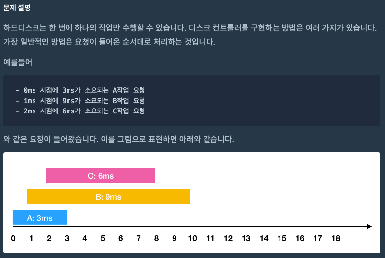
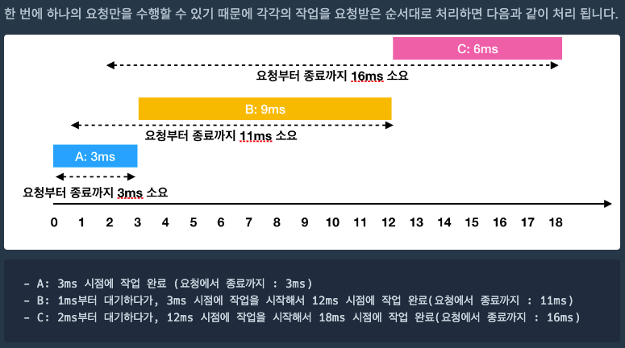
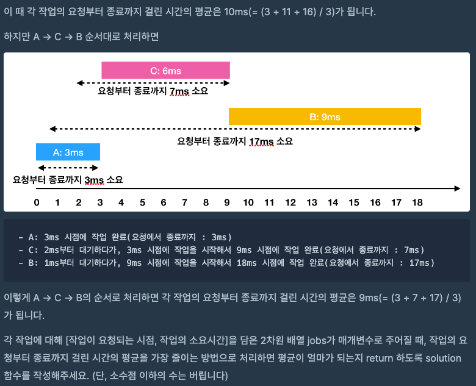
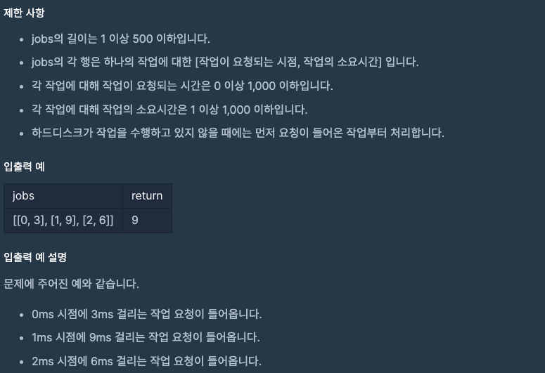

문제 [링크](https://school.programmers.co.kr/learn/courses/30/lessons/42627)






_**Java 풀이**_
```java
import java.util.Arrays;

import java.util.Comparator;
import java.util.PriorityQueue;

class Solution {
    
    class Job {
        private int requestTime = 0;
        private int workingTime = 0;
        
        public Job(){
            // TODO
        }
        
        public Job(int requestTime, int workingTime){
            this.requestTime = requestTime;
            this.workingTime = workingTime;
        }

        public int getRequestTime(){
            return this.requestTime;
        }

        public int getWorkingTime(){
            return this.workingTime;
        }
    }
    
    public int solution(int[][] jobs) {
        int answer = 0;
        
        // 우선 전체 작업 리스트를 요청시간의 오름차순으로 정렬한다.
        Arrays.sort(jobs, new Comparator<int[]>(){
            @Override
            public int compare( int[] a, int[] b ){
                return a[0] - b[0];
            }
        });
        
        int now = 0;
        int total = 0;
        int index = 0;

        // 작업이 진행 중일 때 대기 큐
        // 대기 큐는 요청시간 순이 아닌 작업시간 오름차순으로 정렬한다.
        PriorityQueue<Job> priorityQueue = new PriorityQueue<>(new Comparator<Job>(){
            @Override
            public int compare(Job job1, Job job2){
                return job1.workingTime - job2.workingTime;
            }
        });
        
        // 전체 작업 리스트를 모두 돌거나, 대기 큐 리스트가 있을 때 까지
        while(index < jobs.length || priorityQueue.size() > 0){

            // 현재시간이 n번째 요청시간보다 크거나 같으면 대기 큐에 넣어준다.
            if( index < jobs.length && now >= jobs[index][0] ){
                // 대기 큐에 넣고 다음 작업으로 넘어간다.
                priorityQueue.offer(new Job(jobs[index][0], jobs[index][1]));
                index = index + 1;
                continue;
            }

            if( priorityQueue.size() == 0 ){
                // 대기 큐가 없으면 현재시간을 첫번째 작업의 요청시간으로 세팅한다.
                now = jobs[index][0];
            }else{
                // 대기 큐가 있으면 첫번째 우선순위 작업의 전체시간을 계산한다.
                Job data = priorityQueue.poll();
                
                // 우선 대기큐가 끝났을 때의 현재시간을 계산 (ex: 3 - 9 - 18)
                now = now + data.getWorkingTime();
                
                // 현재 작업의 전체 소요시간 : 현재시간 - 요청시간 (ex : 3 - 7 - 17 )
                total = now - data.getRequestTime();
                // System.out.println(total);
                
                // 전체 요청시간을 누적
                answer = answer + total;
            }
        }
        // System.out.println(answer);
        answer = answer / jobs.length;
        
        return answer;
    }
}
```

_**Javascript 풀이**_
```javascript
function solution(jobs) {
    var answer = 0;    
    
    // 우선 전체 작업 리스트를 요청시간의 오름차순으로 정렬한다.
    jobs.sort(function(a, b){
        return a[0] - b[0];
    });
    
    var now = 0;    // 작업이 완료된 현재 시간
    var total = 0;  // 대기 큐에서 우선순위가 낮은 첫번째 작업의 전체 작업시간
    var index = 0;  // 전체 작업 리스트 인덱스
    
    // 작업이 진행 중일 때 대기 큐    
    var priorityQueue = [];
    
    // 전체 작업 리스트를 모두 돌거나, 대기 큐 리스트가 있을 때 까지
    while( index < jobs.length || priorityQueue.length > 0 ){
        
        // 현재시간이 n번째 요청시간보다 크거나 같으면 대기 큐에 넣어준다.
        if( index < jobs.length && now >= jobs[index][0] ){
            
            // 대기 큐에 넣고 다음 작업으로 넘어간다.
            priorityQueue.push(jobs[index]);
            index = index + 1;
          
            // 대기 큐는 요청시간 순이 아닌 작업시간 오름차순으로 정렬한다.
            priorityQueue.sort(function(a, b){
                return a[1] - b[1];
            });
            
            continue;
        }
        
        if( !priorityQueue.length ){
            // 대기 큐가 없으면 현재시간을 첫번째 작업의 요청시간으로 세팅한다.
            now = jobs[index][0];
        }else{
            // 대기 큐가 있으면 첫번째 우선순위 작업의 전체시간을 계산한다.
            var data = priorityQueue.shift();            
            
            // 우선 대기큐가 끝났을 때의 현재시간을 계산 (ex: 3 - 9 - 18)
            now = now + data[1];
            
            // 현재 작업의 전체 소요시간 : 현재시간 - 요청시간 (ex : 3 - 7 - 17 )
            total = now - data[0];
            
            // 전체 요청시간을 누적
            answer = answer + total;
        }
    }
    // 누적된 전체 요청시간의 평균
    answer = parseInt(answer / jobs.length);
    return answer;
}
```

_**Javascript 생성자 함수를 이용한 풀이**_
```javascript
// 우선순위 큐 클래스
function PriorityQueue(callback){
    this.queue = [];
    this.length = this.queue.length;
    this.callback = callback;
}
// 큐 정렬
PriorityQueue.prototype.sort = function(callback){
    Array.prototype.sort.call(this.queue, this.callback || callback);
};
// 큐 추가
PriorityQueue.prototype.offer = function(value){
    this.queue.push(value);
    this.length = this.queue.length;
    this.sort();
};
// 큐 추가2
PriorityQueue.prototype.add = function(value){
    try{
        this.offer(value);
        return true;
    }catch(Exception){
        throw Error('IllegalStateException');
    }
};
// 우선순위 큐 삭제 - 첫번째 우선순위 데이터를 리턴
PriorityQueue.prototype.poll = function(){
    var result;
    
    if( this.queue.length > 0 )
        result = this.queue.shift();
    else
        result = null;
    
    this.length = this.queue.length;
    return result;
};
// 우선순위 큐 삭제 - 첫번째 우선순위 데이터를 리턴하지 않음
PriorityQueue.prototype.remove = function(){
    this.poll();
};
// 우선순위 큐 초기화
PriorityQueue.prototype.clear = function(){
    this.queue = [];
    this.length = 0;
};

function solution(jobs) {
    var answer = 0;    
    
    // 우선 전체 작업 리스트를 요청시간의 오름차순으로 정렬한다.
    jobs.sort(function(a, b){
        return a[0] - b[0];
    });
    
    var now = 0;    // 작업이 완료된 현재 시간
    var total = 0;  // 대기 큐에서 우선순위가 낮은 첫번째 작업의 전체 작업시간
    var index = 0;  // 전체 작업 리스트 인덱스
    
    // 작업이 진행 중일 때 대기 큐
    // 대기 큐는 요청시간 순이 아닌 작업시간 오름차순으로 정렬한다.
    var priorityQueue = new PriorityQueue(function(a, b){
        return a[1] - b[1];
    });
    
    // 전체 작업 리스트를다 돌지 않았거나, 대기 큐 리스트가 있을 때 까지
    while( index < jobs.length || priorityQueue.length > 0 ){
        // 현재시간이 n번째 요청시간보다 크거나 같으면 대기 큐에 넣어준다.
        if( index < jobs.length && now >= jobs[index][0] ){
            // 대기 큐에 넣고 다음 작업을 찾는다.
            priorityQueue.offer(jobs[index]);
            index = index + 1;
            continue;
        }
        
        if( !priorityQueue.length ){
            // 대기 큐가 없으면 현재시간을 첫번째 작업의 요청시간으로 세팅한다.
            now = jobs[index][0];
        }else{
            // 대기 큐가 있으면 첫번째 우선순위 작업의 전체시간을 계산한다.
            var data = priorityQueue.poll();
            
            
            // 우선 대기큐가 끝났을 때의 현재시간을 계산 (ex: 3 - 9 - 18)
            now = now + data[1];
            
            // 현재 작업의 전체 소요시간 : 현재시간 - 요청시간 (ex : 3 - 7 - 17 )
            total = now - data[0];
            
            // 전체 요청시간을 누적
            answer = answer + total;
        }
    }
    // 누적된 전체 요청시간의 평균
    answer = parseInt(answer / jobs.length);
    return answer;
}
```
