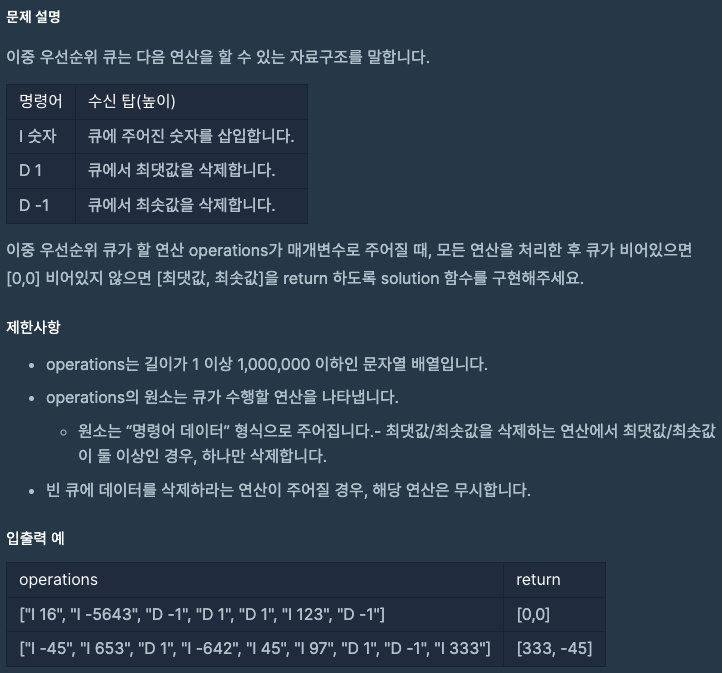
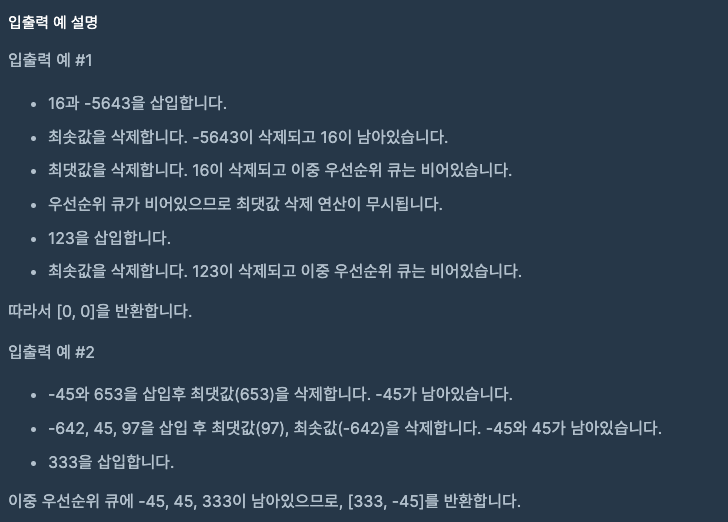

문제 [링크](https://school.programmers.co.kr/learn/courses/30/lessons/42628)




_**Java 풀이**_
```java
import java.util.PriorityQueue;
import java.util.Collections;

class Solution {
        
    public int[] solution(String[] operations) {
        int[] answer = new int[2];
        
        PriorityQueue<Integer> minQueue = new PriorityQueue<Integer>();
        PriorityQueue<Integer> maxQueue = new PriorityQueue<Integer>(Collections.reverseOrder());

        for(String operation : operations){
            String div = operation.split(" ")[0];
            int value = Integer.parseInt(operation.split(" ")[1]);            
            int temp = 0;
            
            if( div.equals("I") ){
                // 첫글자가 'I'일 경우, 숫자를 삽입
                minQueue.offer(value);
                maxQueue.offer(value);
            }else{
                
                // 빈 큐에 데이터를 삭제하라는 연산이 주어질 경우, 해당 연산은 무시
                if( minQueue.isEmpty() || maxQueue.isEmpty() ) continue;
                
                // 첫글자가 'D'일 경우, 최대값/최소값을 삭제
                switch(value){
                    case 1: 
                        // 최대값 삭제
                        temp = maxQueue.peek();                        
                        break;
                    case -1:
                        // 최소값 삭제
                        temp = minQueue.peek();
                        break;
                }
                // 양쪽 우선순위 큐 모두 다 같은 값을 삭제한다.
                maxQueue.remove(temp);
                minQueue.remove(temp);
            }
        }
        
        // 결과 값 정의
        answer[0] = maxQueue.isEmpty() ? 0 : maxQueue.peek();
        answer[1] = minQueue.isEmpty() ? 0 : minQueue.peek();
        
        return answer;
    }
}
```

_**Javascript 풀이**_
```javascript
function solution(operations) {
    var answer = [];
    var priorityQueue = new Array();    
    var index, operation, div, val;
    for(index = 0; index < operations.length; index = index + 1){
        operation = operations[index];  // 명령
        div = operation.split(' ')[0];  // 구분자
        val = operation.split(' ')[1];  // 값
                
        if( div === 'I' ){
            
            // 첫글자가 'I'일 경우, 숫자를 삽입
            priorityQueue.push(val);
            
        }else{
            
            // 빈 큐에 데이터를 삭제하라는 연산이 주어질 경우, 해당 연산은 무시
            if( priorityQueue.length == 0 ) continue;
            
            // 첫글자가 'D'일 경우, 최대값/최소값을 삭제            
            switch(parseInt(val)){
                // 최댓값 삭제
                case 1:
                    // 최대값 삭제를 위해 내림차순 정렬
                    priorityQueue.sort(function( a, b ){ return b - a; });
                    break;
                // 최솟값 삭제
                case -1:
                    // 최소값 삭제를 위해 오름차순 정렬
                    priorityQueue.sort(function( a, b ){ return a - b; });
                    break;
            }
            priorityQueue.shift();
        }
    }
        
    if( !priorityQueue.length ){
        // 우선순위 큐가 비어있으면 [0,0]을 반환
        answer = [0, 0];
    }else{
        // 우선순위 큐가 비어있지 않으면 최대값,최소값 순으로 배열에 넣어 반환
        answer.push(Math.max.apply(null, priorityQueue));
        answer.push(Math.min.apply(null, priorityQueue));        
    }
    return answer;
}
```
