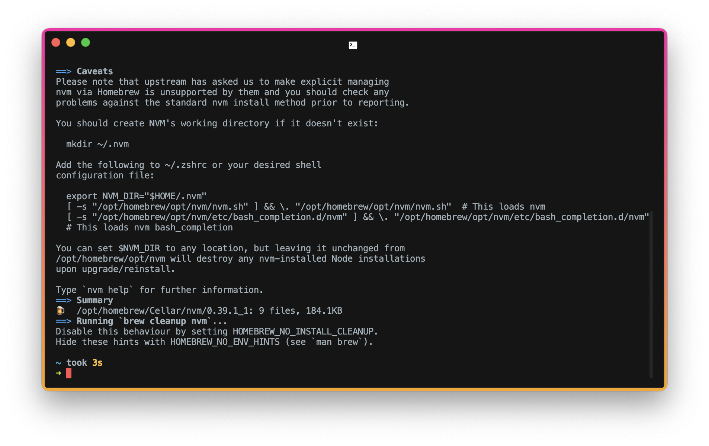

원래 나는 맥북에어를 약 1년간 사용해왔는데, 인텔리제이를 돌렸더니 멈췄다. (젠장 -_-)

그래서 몇달을 고민하다 맥북프로로 넘어왔는데, node를 설치한 후에 블로그 포스팅을 하려고 npm install 명령어를 때렸더니 오류가 났다.

찾아봤더니 설치된 버전이 16이어서, 버전이 안맞아서 그렇단다.

그래서 기존에 설치했던 Node를 다 지우고, brew install node@14로 설치를 하려고 했으나 또 오류가 났다. 

#### nvm 다시 설치
```bash
brew install nvm
```

설치가 되었다면 아래 그림처럼 결과가 나오는데, 자세히 보면 NVM이 동작하지 않을 경우에 대한 설명이 나온다.


#### nvm 폴더 생성
```bash
mkdir ~/.nvm
```

#### .zshrc 수정
```bash
vi ~/.zshrc
```

#### INSERT 모드로 아까 터미널에 있던 아래 내용을 최하단에 붙여넣고 저장한다.
```bash
export NVM_DIR="$HOME/.nvm"
[ -s "/opt/homebrew/opt/nvm/nvm.sh" ] && \. "/opt/homebrew/opt/nvm/nvm.sh"  # This loads nvm
[ -s "/opt/homebrew/opt/nvm/etc/bash_completion.d/nvm" ] && \. "/opt/homebrew/opt/nvm/etc/bash_completion.d/nvm"  # This loads nvm bash_completion
```

#### 낮은 버전의 Node 설치 (여기선 14)
```bash
nvm install 14.17.0
```

설치가 되고, 아래와 같이 버전이 정상적으로 나오면 끝이다.
```bash
node -v
v14.17.0
```

출처 :
https://caileb.tistory.com/206
