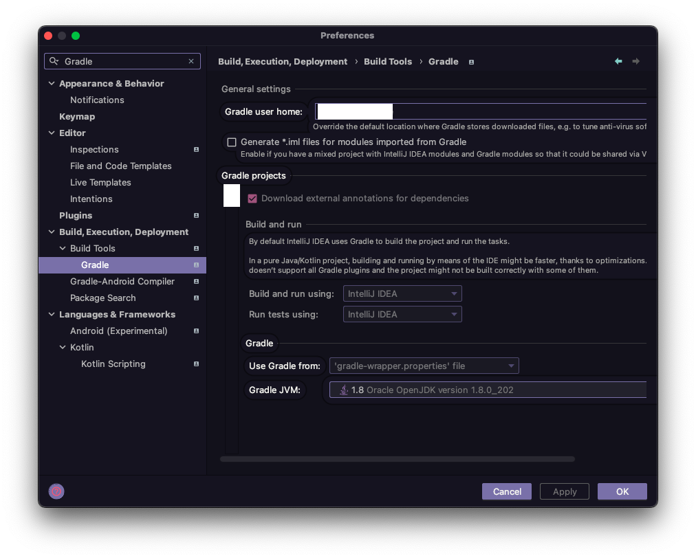

### 이 포스팅은 지속적으로 업데이트합니다.
 
 

#### 시작 화면 설정
* 프로그램 실행 시 프로젝트 선택 창 노출하도록
   Settings → Appearance > System Settings → Reopen projects on startup

#### Spring 
* Gradle 사용 시 
   Build and run using, Run tests using → IntelliJ IDEA

#### Plugins
* GitToolBox
* Key Promoter X
* CodeGlance Pro
* Rainbow Brackets
* Quick File Preview

* MyBatisX
* JPA Buddy

* Dracula Pro
* Power mode 2
* Pokemon Progress
* Atom Material Icons
* Material Theme UI Lite

