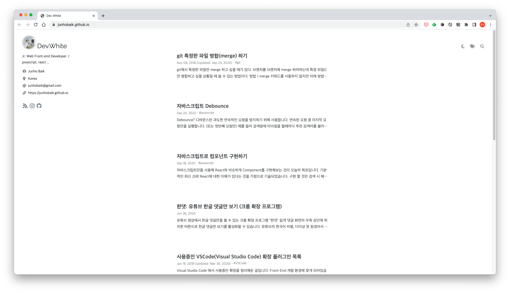
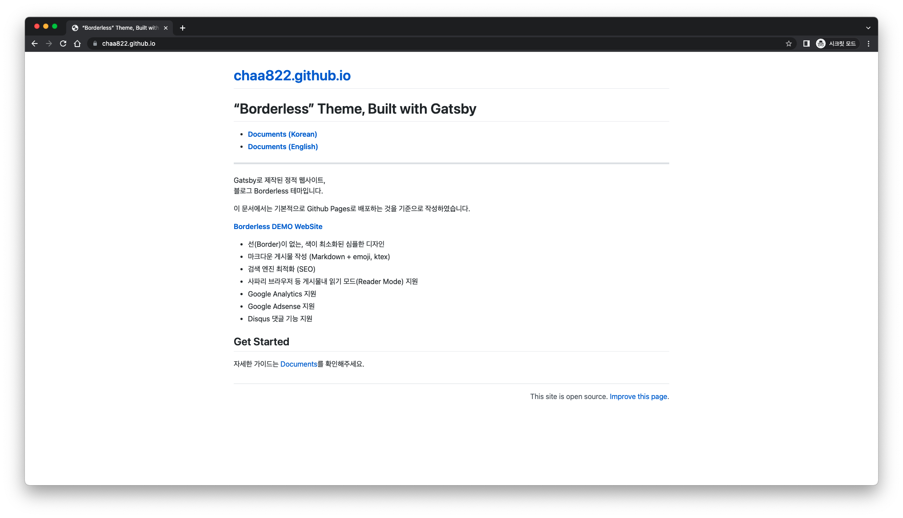
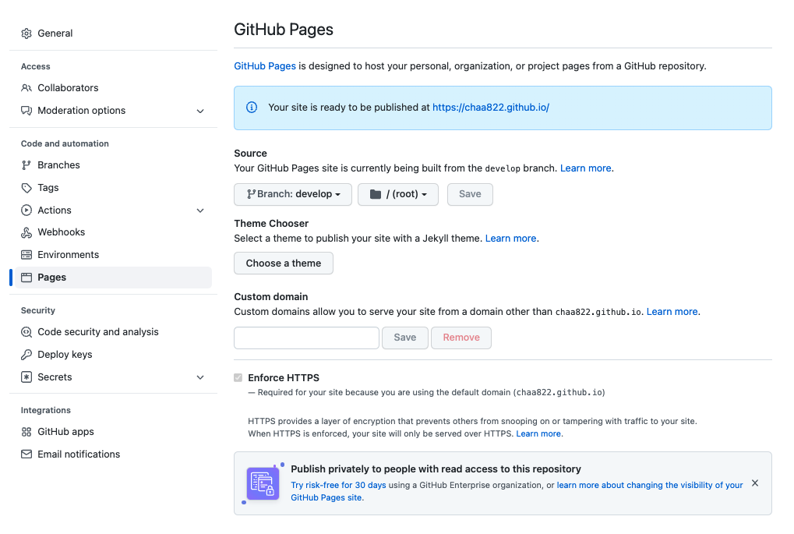

본 블로그를 이루고 있는 테마에 대해 소개하고자 한다.

지금까지 나는 tistory, velog 등 쉽고 빠르게 접근할 수 있는 블로그 서비스들을 개인 저장소겸 블로그로 이용해왔다.

그러던 중에 맥을 사용하게 돼서 하이퍼 터미널 검색 도중 백준호님의 블로그를 구경하게 됐다.

블로그가 하나부터 열까지 마음에 쏙 들어서 링크를 타고 깃허브에 갔더니 테마를 쉽게 사용할 수 있도록 [문서화](https://github.com/junhobaik/junhobaik.github.io/wiki/Document-(Borderless))까지 해놓으신걸 보고, 블로그를 만들게 되었다.

테마를 적용하고 싶다면 상기 링크의 문서를 참고하여 백준호님의 [github repository](https://github.com/junhobaik/junhobaik.github.io)에서 Fork/Clone 해서 적용할 수 있다.

이 테마를 공유해주신 백준호님에게 감사의 말씀 드리고 싶다.

 
 

적용하면서 documents에서 찾을 수 없었던 내용이 있는데

나는 repository의 이름, _config.js를 설정하고 deploy했더니 아래와 같이 블로그가 안나오고 README가 나왔다 -.-

혹시나 나와 같이 블로그가 안나오고 README가 나온다면 아래 설정을 확인해 봐야 한다.

#### repository > settings > Pages 이동 : branch > develop를 master로 변경

